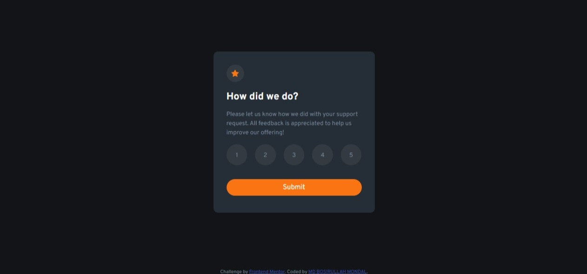

# Frontend Mentor - Interactive rating component solution

This is a solution to the [Interactive rating component challenge on Frontend Mentor](https://www.frontendmentor.io/challenges/interactive-rating-component-koxpeBUmI). Frontend Mentor challenges help you improve your coding skills by building realistic projects. 

## Table of contents

## Overview

### The challenge

Users should be able to:

- View the optimal layout for the app depending on their device's screen size
- See hover states for all interactive elements on the page
- Select and submit a number rating
- See the "Thank you" card state after submitting a rating

### Screenshot

### Links

- Solution URL: [https://github.com/bosirullah/challenge8](https://github.com/bosirullah/challenge8)
- Live Site URL: [https://bosirullah.github.io/challenge8/](https://bosirullah.github.io/challenge8/)

## My process

### Built with

- Semantic HTML5 markup
- CSS custom properties
- javascript
- Mobile-first workflow
- [bootstrap](https://getbootstrap.com/) - css framework

### What I learned

I have learnt to use javascript.

## Author

- Website - [MD BOSIRULLAH MONDAL](https://github.com/)
- Frontend Mentor - [@bosirullah](https://www.frontendmentor.io/profile/bosirullah)
